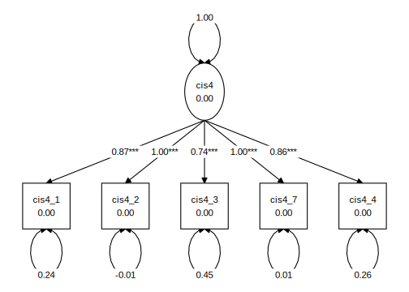
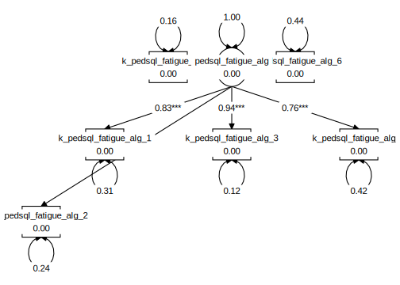

```{r setup, include=FALSE}
knitr::opts_chunk$set(echo = FALSE)
```

```{r}
library(worcs)
f <- list.files(pattern = "^\\d{4}.+?csv$")
df <- read.table(f[1], sep = ";", header = TRUE, stringsAsFactors = FALSE)
names(df) <- gsub("_recoded", "", names(df), fixed = TRUE)
names(df) <- gsub("^k_(ped)?", "", names(df))
names(df) <- gsub("_fatigue_alg", "", names(df))

scales_list <- grep("_\\d$", names(df), value = TRUE)
scales_list <- split(scales_list, factor(gsub("_\\d", "", scales_list)))

# Bijgevoegd de uitkomsten van de CIS4 (4 items) en pedsQL MFS (6 items). Beide kind gerapporteerd. De ID is niet meer terug te leiden naar de oorspronkelijke deelnemer, wel te gebruiken om binnen 1 persoon naar de uitkomsten te kijken, mocht je dat willen doen.
# MT staat voor measurement time, en geeft dus de chronologie aan.
#
# De items van de CIS (1-7)zijn deels recoded; hiermee geldt bij deze allemaal: hoger is meer moe.
# De items van de pedsql (1-4) zijn allemaal nog niet omgezet, waarmee hier ook geldt: hoger is meer moe.
#
#
# Ouder gerapporteerde  MFS heb ik nu niet aangeleverd, aangezien we die alleen voor imputatie gaan gebruiken. Laat het weten als je die wel wilt hebben.
# Dit is de beschikbare vermoeidheidsdata van de export uit najaar 2024; dus niet de volledige set te gebruiken voor de studie.
#
# Harstikke fijn dat je hier naar wilt kijken!
#   Laat het weten als je meer nodig hebt, of vragen hebt.


# In this file, write the R-code necessary to load your original data file
# (e.g., an SPSS, Excel, or SAS-file), and convert it to a data.frame. Then,
# use the function open_data(your_data_frame) or closed_data(your_data_frame)
# to store the data.

library(tidySEM)


# Psychometrics -----------------------------------------------------------

desc <- tidySEM::descriptives(df)

# Variables with < 10 unique values are treated as ordinal
is_ordered <- desc$name[desc$unique < 10]
df[is_ordered] <- lapply(df[is_ordered], ordered)

scales_list[["combined"]] <- unlist(scales_list)
# Make data long for multilevel CFA
psychmet <- lapply(names(scales_list), function(scal){
  #scal = names(scales_list)[1]
  indicators <- scales_list[[scal]]
  syntx <- paste0(scal, "=~", paste0(indicators,
                                     collapse = " + "
  ))

  df_tmp <- df[, indicators]
  df_num <- df_tmp
  df_num[] <- lapply(df_num, as.numeric)
  res_fa <- stats::prcomp(cor(df_num, use = "pairwise.complete.obs"))

  res_par <- psych::fa.parallel(cor(df_num, use = "pairwise.complete.obs"), n.obs = nrow(df_num))


  # Any ordered
  is_ordr <- sapply(df_tmp, inherits, what = "ordered")
  # CFA
  res <- lavaan::cfa(
    model = syntx,
    data = df_tmp,
    ordered = if(any(is_ordr)){names(df_tmp)[is_ordr]} else {NULL},
    std.lv = TRUE,
    auto.fix.first = FALSE
  )
 p <- graph_sem(res, angle = 179)
 ggplot2::ggsave(paste0(scal, "_sem.svg"), p, device = "svg")

fits <- try(tidySEM::table_fit(res)[, c("Parameters", "chisq", "df", "cfi", "tli", "rmsea", "srmr")], silent = TRUE)
  if(inherits(fits, "try-error")){
    fits <- structure(list(Parameters = NA, chisq = NA, df = NA,
                           cfi = NA, tli = NA, rmsea = NA,
                           srmr = NA), class = c("tidy_fit", "data.frame"
                           ), row.names = c(NA, -1L))
  }
  tab <- data.frame(variable = scal,
                    items = length(indicators),
                    fits)

  tab$comp_rel <- semTools::compRelSEM(res, ord.scale = any(is_ordr))
  tab$kaiser <- sum(res_fa$sdev^2 > 1)
  tab$par_factors <- res_par$nfact
  tab$par_components <- res_par$ncomp
  tmp <- table_results(res, columns = NULL)
  tmp <- as.numeric(tmp$est[tmp$op == "=~"])
  tab$min_L <- min(tmp)
  tab$max_L <- max(tmp)
  return(tab)
})

tab_psychometrics <- do.call(rbind, psychmet)


syntx <- c(paste0("C =~", paste0(unlist(scales_list),
                                   collapse = " + "
)),
paste0("CIS4 =~", paste0(scales_list[[1]],
                      collapse = " + "
)),
paste0("SQL =~", paste0(scales_list[[2]],
                         collapse = " + "
)), "CIS4 ~~ SQL", "CIS4 ~~ 0*C", "SQL ~~ 0*C")

res <- lavaan::cfa(model = syntx,
                   data = df,
                   ordered = unlist(scales_list),
                   std.lv = TRUE,
                   auto.fix.first = FALSE)

tab_fit <- table_fit(res)[c("Parameters", "chisq", "df", "cfi", "tli", "rmsea", "srmr")]
tab_res <- table_results(res, columns = NULL)

```

```{r tabcfa}
knitr::kable(tab_psychometrics, caption = "Psychometrics of fatigue scales")
```

The model fit of a CFA is excellent, for both scales independently and for a combined model of both scales combined.

Given that theory dictates a 1-dimensional model for these scales, and given the very high factor loadings and excellent fit, I would say these are unidimensional scales.

However, Kaiser's criterion does not suggest any factors can be extracted; parallel analysis indicates that 2 factors exceed factors extracted from random data (4 factors for the combined scale), and that 1 principal component exceeds components extracted from random data.

A one-dimensional model has very high, near-perfect, composite reliability.

The factor loadings for all models are high (between 0.66 - 1.00).

Note that two items are perfectly correlated: CIS4_2 and CIS4_7. That means that these items do not convey unique information. They are redundant.

```{r figcis, fig.cap="Graphical representation of the CIS4 model"}

```


```{r figSQL, fig.cap="Graphical representation of the SQL model"}

```

## Multi-Trait Multi-Factor Model

We could also consider a model where the item responses load onto one common factor, and onto two distinct (scale-specific) factors. This model, too, fits very well.

```{r tabfigmtmf}
knitr::kable(tab_fit, caption = "MTMF model fit")
```

What we see in the table below is that all items load highly on a common factor, meaning that they all measure one underlying construct well.
The lowest loading items are SQL 5 and 6.

Most items load little on their scale-specific variables, indicating little scale-specific variance. Some items are exceptions to this.


```{r}
library(data.table)
tmp <- as.data.table(tab_res)
tmp <- tmp[tmp$op == "=~", .SD, .SDcols = c("lhs", "rhs", "est")]
tmp <- dcast(tmp, rhs ~ lhs)
knitr::kable(as.data.frame(tmp), caption = "Loadings in MTMM model")
```


